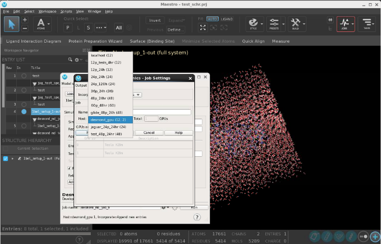
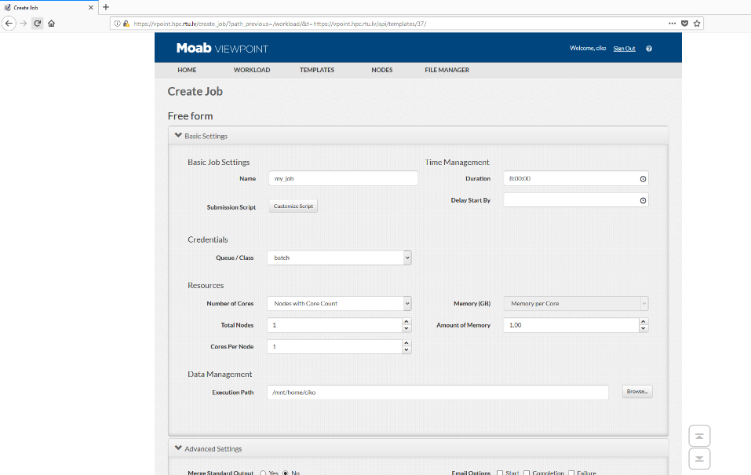

# User Interfaces

There are several options users may take to work on the cluster:
- command line (remote terminal) interface
- graphical interface of application software (GUI)
- web interface

## Command line
That is a traditional manner of accessing the cluster. A user uses the Internet to connect to a remote terminal (through a secure shell (SSH) protocol usually) where commands can be executed in a text mode. It is possible to edit and compile a code, place a job (simulation) in the queue, and monitor the job's course of execution. Graphical tools can also be called from a command line. Instructions in this guide are mainly intended for command-line access.
 
 
 <!-- .element height="50%" width="50%" -->
 
## GUI of Application Software
Some software packages (like Schrodinger, MATLAB, etc.) have in-built support for parallel computing on a cluster. A user can either perform a simulation locally or on a cluster, without leaving the regular software environment. In case of such software like Schrodinger, the cluster can be used by opening the graphical interface either locally on the personal computer or remotely on the cluster login node.
 

## Web interface
Access to the cluster using an HTTPS protocol by opening a graphical interface (portal) on an Internet browser.

### Moab Viewpoint 
Viewpoint is a graphical interface for submitting and managing jobs in a similar manner as in command line but the graphical environment. Access to this interference should be asked by contacting hpc@rtu.lv.
 

 
### Galaxy
[Galaxy](http://galaxyproject.org/) is an open platform for supporting data intensive research with focus on biomedical data (for example, genome, transcriptome, proteome) analyses. The analyses can be performed using graphical tools and hence could be easily performed also by non-bioinformaticians. RTU HPC Galaxy instance is available here: [https://galaxy.hpc.rtu.lv](https://galaxy.hpc.rtu.lv). Access to this galaxy can be requested by sending an email to hpc@rtu.lv. You should be able to auto-register also with your RTU HPC cluster credentials. Any requests regarding tools or reference datasets can be sent to support e-mail as well. In the next Figure example quality control report in Galaxy using FastQC is shown.

